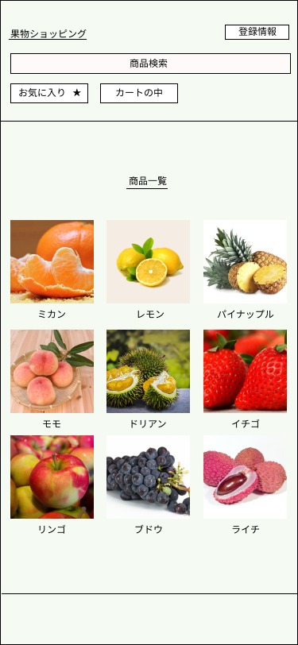

### 画面詳細図
## トップページ
### プロトタイプは以下のリンク先
[プロトタイプ](https://www.figma.com/file/Vc9oUvVfiAsy6KJbc6CcWD/%E3%82%B7%E3%83%A7%E3%83%83%E3%83%94%E3%83%B3%E3%82%B0?node-id=1%3A3)
*****

*****
補足:対応DBの列はDB設計後、○を対応するテーブル・カラム名に差し替えること。

| ID | 要素 | 内容 | アクション | イベント | 対応DB |
|----|-----|------|-----------|----------|-------|
|1|バナー|サイト名表示|-|-|-|
|2|ログイン|テキスト画像|-|-|-|
|3|Eメールアドレス 電話番号|入力欄|テキスト入力|-|○|
|4|パスワード|入力欄|テキスト入力|-|○|
|5|ログインボタン|ボタン|クリック|ログイン処理実行||
|6|商品検索|テキスト画像|-|-|-|
|7|商品名|テキスト表示|-|-|-|
|8|商品名|入力欄|テキスト入力|-|○|
|9|カテゴリ|テキスト表示|-|-|-|
|10|商品|テキスト画像|-|-|-|
|16|検索|ボタン|クリック|検索処理実行|○|
|17|商品一覧|画像ボタン|クリック|商品一覧へ遷移|○|
|18|カートの中|画像ボタン|クリック|カートの中へ遷移|○|
|19|登録情報|画像ボタン|クリック|登録情報へ遷移|○|
|20|商品一覧|テキスト表示|-|-|○|
|21|商品画像|画像リンク|クリック|商品詳細へ遷移|○|
|22|商品名|テキストリンク|クリック|商品詳細へ遷移|○|
|23|価格|テキスト表示|クリック|-|○|
|24|姓名|入力欄|テキスト入力|-|○|
|25|フリガナ|入力欄|テキスト入力|-|○|
|26|アカウントを作成|入力欄|テキスト入力|-|○|
|27|今すぐログイン|入力欄|テキスト入力|-|○|
|28|パスワードを表示|チェックボックス|クリック|-|○|
|29|お気に入り|チェックボックス|クリック|-|○|
|30|カートの中|ボタン|クリック|カートの中へ遷移|○|
|31|個数選択|ボタン|クリック|-|○|
