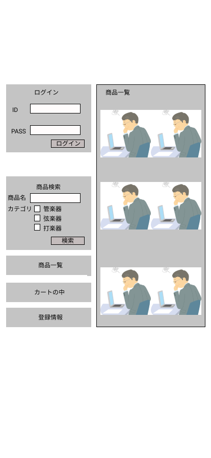

### 画面詳細図
## トップページ
### プロトタイプは以下のリンク先
[プロトタイプ](https://www.figma.com/file/f6OlDEPWUkkiuds7MFC7UA/Untitled?node-id=1%3A2)
*****

*****
補足:対応DBの列はDB設計後、○を対応するテーブル・カラム名に差し替えること。

| ID | 要素 | 内容 | アクション | イベント | 対応DB |
|----|-----|------|-----------|----------|-------|
|1|バナー|サイト名表示|-|-|-|
|2|ログイン|サイト名表示|-|-|-|
|3|ID|サイト名表示|-|-|○|
|4|PASS|サイト名表示|-|-|○|
|5|ログインボタン|サイト名表示|-|-||
|6|商品検索|サイト名表示|-|-|-|
|7|商品名|サイト名表示|-|-|-|
|8|商品名|サイト名表示|-|-|○|
|9|カテゴリ|サイト名表示|-|-|-|
|10|管楽器|サイト名表示|-|-|-|
|11|管楽器|サイト名表示|-|-|○|
|12|弦楽器|サイト名表示|-|-|-|
|13|弦楽器|サイト名表示|-|-|○|
|14|打楽器|サイト名表示|-|-|-|
|15|打楽器|サイト名表示|-|-|○|
|16|検索|サイト名表示|-|-|○|
|17|商品一覧|サイト名表示|-|-|○|
|18|カートの中|サイト名表示|-|-|○|
|19|登録情報|サイト名表示|-|-|○|
|20|商品一覧|サイト名表示|-|-|○|
|21|商品画像|サイト名表示|-|-|○|
|22|商品名|サイト名表示|-|-|○|
|23|価格|サイト名表示|-|-|○|

